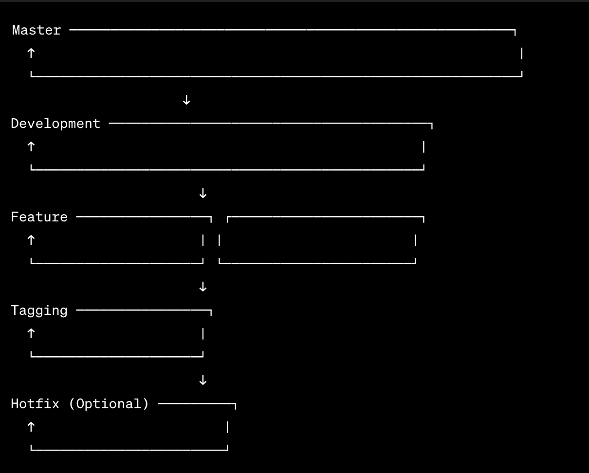

# Project Branching Strategy and Workflow Blueprint 
# Please don't hesitate to change and commit according to your understanding 
# Don't forget to add a commit message with the change

## Branching Strategy:

### 1. Master Branch:
- Contains stable, production-ready code.
- Merges from development and hotfix branches.

### 2. Development Branch:
- Integration branch for ongoing development.
- Feature branches are merged into development.

### 3. Feature Branches:
- Created for each new feature, bug fix, or enhancement.
- Merged back into the development branch upon completion.

### 4. Hotfix Branch (Optional):
- Created from master to fix critical issues in production.
- Merged into both master and development.

### 5. Tags:
- Used for versioning and marking releases.
- Represent stable points in the codebase.

## Simplified Workflow:

1. **Feature Development:**
   - Developers create feature branches for their tasks.
   - Work on the feature branch and submit a pull request for review.

2. **Code Review:**
   - Team reviews and approves the feature branch.

3. **Integration and Testing:**
   - Feature branches are merged into development for testing.

4. **Master Deployment:**
   - When a set of features is ready, merge development into master.
   - Deploy the stable code to the production environment.

5. **Tags:**
   - Create tags for versioning and marking releases.
   - Tags represent stable points in the codebase.

6. **Hotfix (Optional):**
   - Create a hotfix branch from master to fix critical issues.
   - Merge the hotfix into both master and development.

## Visual Explanation:

